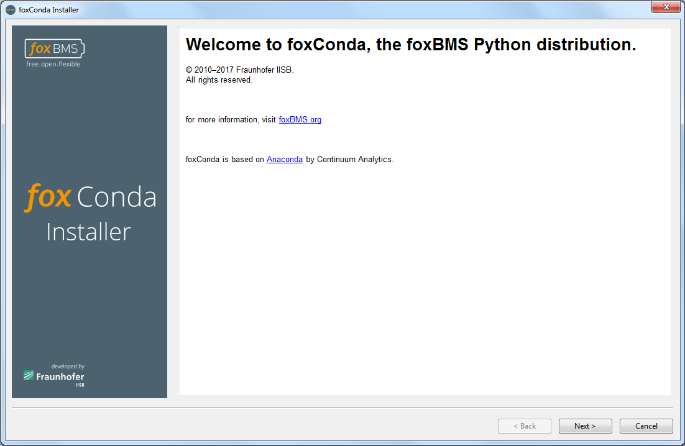
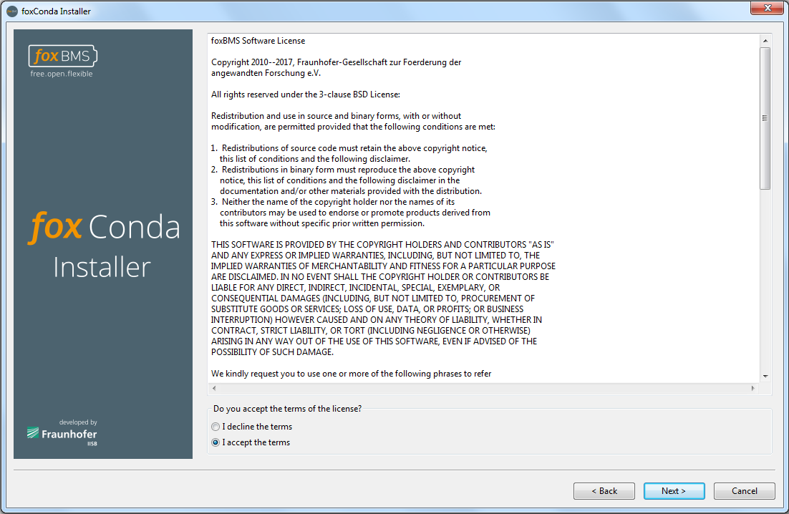
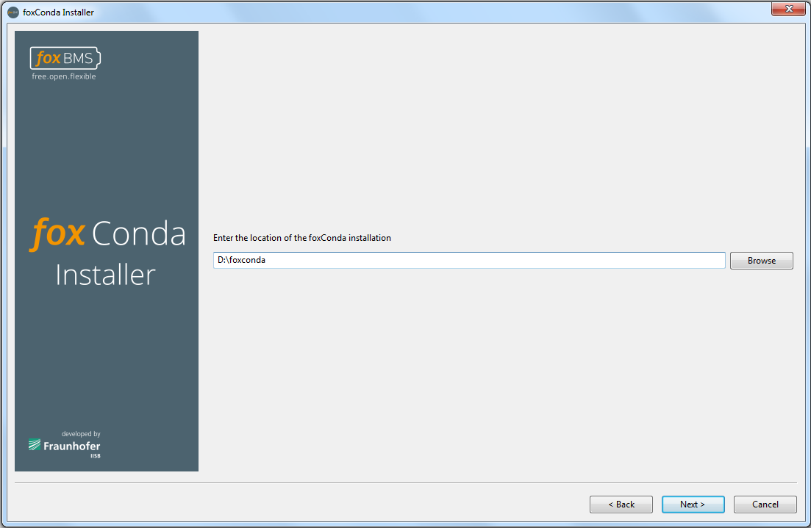
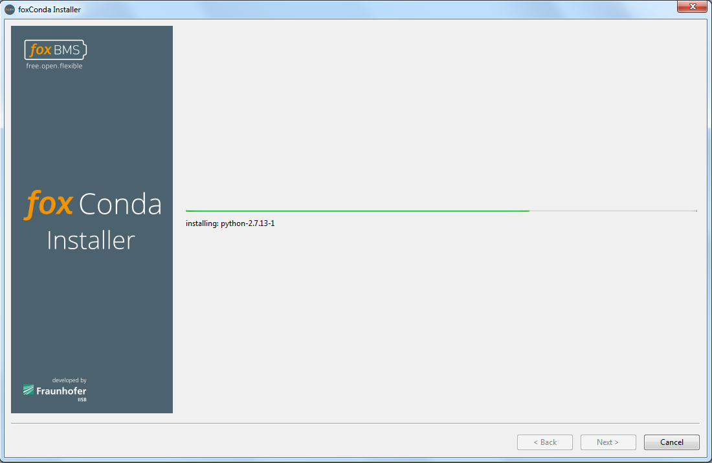
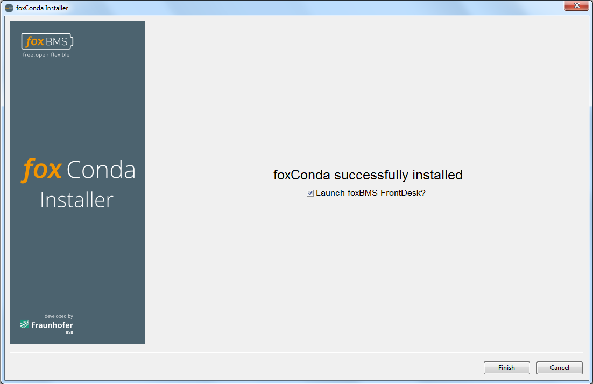
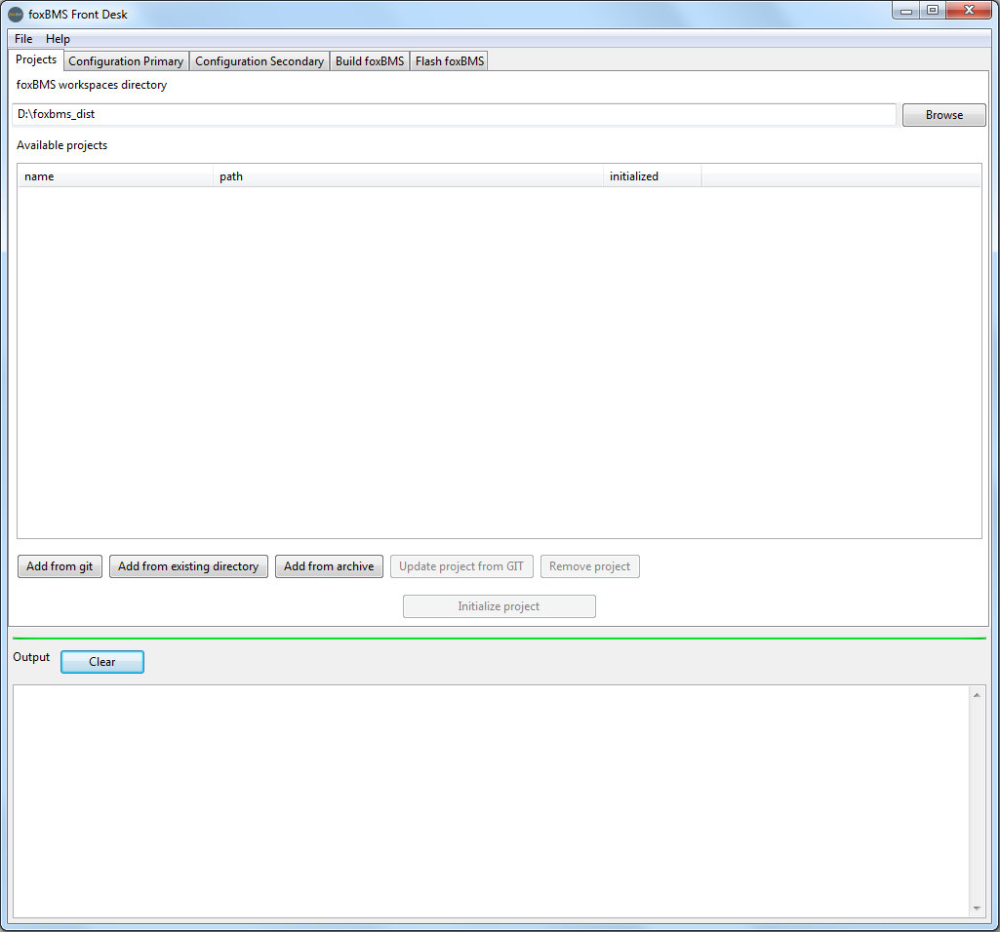
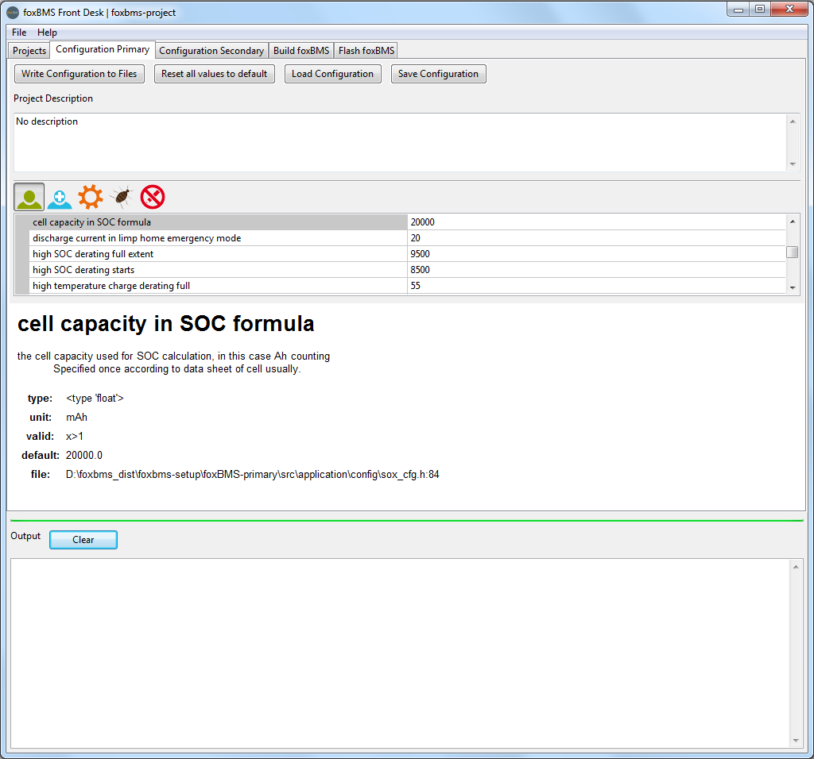
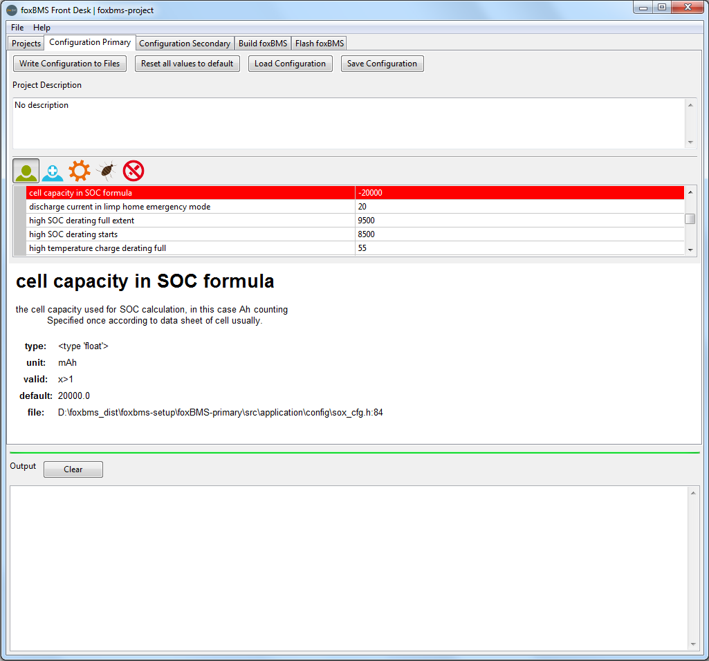
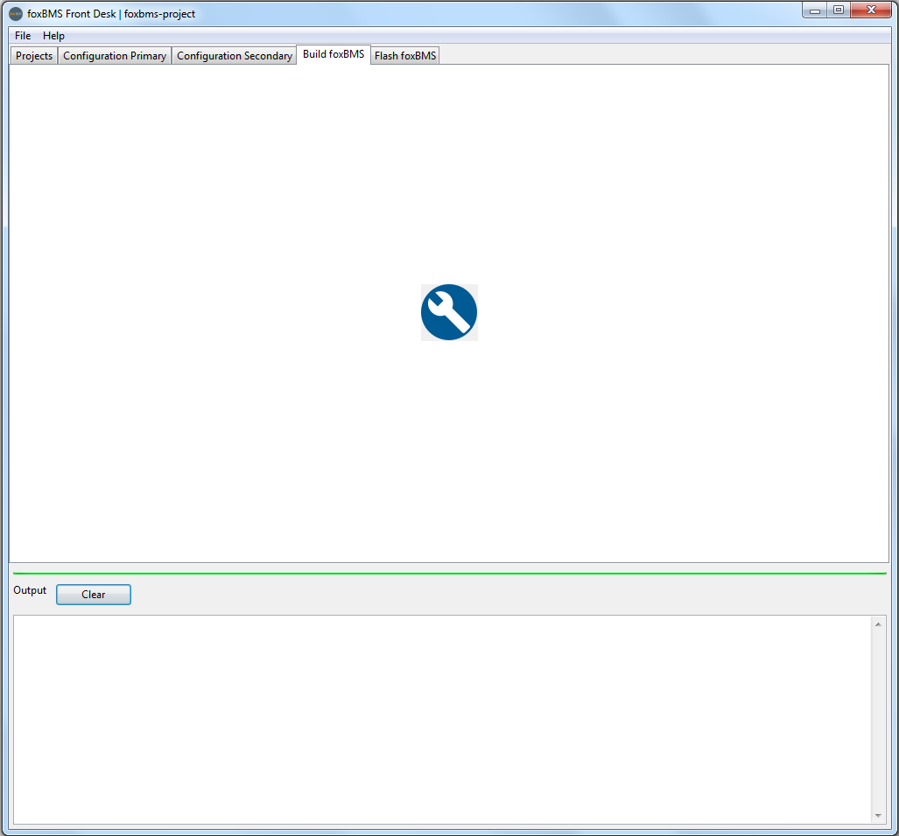

.. include:: ../../macros.rst

.. _getting_started_foxconda:

=====================
Installing |foxconda|
=====================

The |foxbms| embedded software consists of a program written in C. Before it
can be flashed and run on the microcontroller units (i.e., |MCU0| and |MCU1|
located on the |BMS-Master|), it must be compiled to generate a binary file
called firmware.

Different softwares (i.e., the software toolchain) are needed for this
compilation step. They are based on a Python environment. All the needed
software, including the Python environment, are contained in a Python
distribution called |foxconda|. It will be installed in the next steps.

In addition, some parameters can be adjusted in the sources before compilation,
to change the behavior of the software. A graphical environment is provided to
simplify all theses tasks (i.e., configuration, compilation, flashing).

This section shows how to:

1. Set up the development environment, |foxconda| (the software toolchain)
2. Launch the graphical development tool
3. Configure the |foxbms| source
4. Compile the |foxbms| source

In the section :ref:`getting_started_flashing`, it is shown how the compiled
sources are flashed on the |Master|.

-------------------------------------------------------------------
Installation of the needed software via the |foxconda| distribution
-------------------------------------------------------------------

The first step is to install the software environment needed to compile and
flash the |foxbms| sources. First, the |foxconda| installer must be downloaded
from the `server <https://iisb-foxbms.iisb.fraunhofer.de/foxbms/>`_ containing
the |foxconda| installers.
For Windows, the installer is run by executing |installer archive|.

.. warning::
    Do not install |foxconda| into a directory containing whitespace, e.g. for
    Windows ``C:\Program Files``, ``C:\Program Files (x86)`` etc.

The window shown in :numref:`fig. %s <condainstaller1>` will appear.

.. _condainstaller1:

   Installer start page

On this window, the |foxbms| webpage can be accessed by clicking on the link in
blue.

Then by clicking on ``Next >`` the license shown in :numref:`fig. %s
<condainstaller2>` is displayed.

.. _condainstaller2:

   Installer license terms

To continue, the license terms must be accepted (check ``I accept the terms``)
before
clicking on ``Next >``.

An installation directory must be selected :numref:`fig. %s <condainstaller3>`.

.. _condainstaller3:

   Installation path for the Front Desk environment

A default location is proposed, which can be changed. Clicking
on ``Next >`` starts the installation as shown in
:numref:`fig. %s <condainstaller4>`. This step can take several minutes.

.. _condainstaller4:

   Installation progress

The login credentials may be asked to generate start menu and
desktop shortcuts for the development tools.

Once the installation is complete, the message shown in :numref:`fig. %s
<condainstaller5>` appears.

.. _condainstaller5:

   Installation end

Here, it can be chosen to launch the |foxbms| |frontdesk|-the graphical user
interface that configures, builds and flashes the software-immediately after
finishing the installation.

If shortcuts were created, they can be used to start the |frontdesk| or a
terminal environment.

To start the |frontdesk| manually, it must be navigated to the ``FOXCONDA\
Scripts`` directory, where ``FOXCONDA`` is the installation directory of the
|foxconda| distribution, for example, ``C:\Users\Me\foxconda``. After the
program, called ``foxbms.exe`` was found, a double click on it will launch it.

In addition, if it is preferred to build |foxconda| from the command line, the
convenience terminal environment can be used by executing ``fbterminal.exe``,
which is also located under ``FOXCONDA\Scripts``. It will open a CMD window
with a PATH environment ready to configure, compile and flash |foxbms|.

-------------------------------------------------------------------------
Configuration, Compilation and Flashing with the Graphical User Interface
-------------------------------------------------------------------------

.. note::
    |foxconda| comes with the version control system ``git``. ``git`` has to be
    configured before obtaining the sources. Open the terminal environment with
    ``fbterminal.exe`` and set your name and email address:

    .. code-block:: Shell

        git config --global user.name "Your Name"
        git config --global user.email "your@emailaddress"

    If you are behind a proxy you have to set your ``http`` and/or ``https``
    proxy accordingly:

    .. code-block:: Shell

        git config --global http.proxy http://your-http-proxy:your-http-port
        git config --global https.proxy http://your-https-proxy:your-https-port

On Windows this configuration is stored in ``%HOMEDRIVE%%HOMEPATH%\.gitconfig``
which normally should point to ``C:\users\your-user-name\.gitconfig``. On
Linux/macOS this configuration is stored in ``~/.gitconfig``.

Get the |foxbms| sources via the terminal
=========================================

The sources are available on `GitHub <https://github.com/foxBMS/>`_. They
consists of several repositories.
One of the repositories is called ``foxBMS-setup`` and contains tools to
download everything needed from GitHub.

Open the terminal environment with ``fbterminal.exe`` as explained previously.
Then with git, clone the repository https://github.com/foxBMS/foxBMS-setup with
the command

.. code-block:: Shell

    git clone https://github.com/foxBMS/foxBMS-setup.git

Go to the created directory and run the following command:

.. code-block:: Python

    python bootstrap.py

If everything works correctly, the following repositories will be cloned from
GitHub:

* foxBMS-primary
* foxBMS-secondary
* foxBMS-documentation
* foxBMS-hardware
* foxBMS-tools
* FreeRTOS
* hal

This is also described in the build section
(:ref:`software_documentation_build`).

The sources and the documentation are build with the script ``build.py``. Use
``python build.py -h`` to get all available build options.
The script ``clean.py`` is used to clean the generated binaries and
documentation. Use ``python clean.py -h`` to get all available clean options.

Get the |foxbms| sources via the IDE
====================================

The |foxbms| configuration and flash IDE is started with ``foxbms.exe`` as
described in the previous section.

When the program starts, a terminal window may appear. This is normal. It will
disappear when the program is closed.

The IDE starts with the source selection tab shown in :numref:`fig. %s
<frontdesk_figure1>`.

.. _frontdesk_figure1:

   Project selection tab

A project corresponds to the |foxbms| source code tree located on the computer.
 A folder must be created were the projects
will be stored. First, the ``foxBMS workspaces directory`` must be clicked on
to select the folder that was created,
under which all the new |foxbms| projects will be placed.

Click on the button ``Add from git``. In the dialog, if it is not already the
case, specify https://github.com/foxBMS/foxBMS-setup as the GIT repository.
Enter the wanted project name. In the main window, click on the project name to
select it. Then click on ``Initialize project``.
This will fetch the sources on GitHub, put them in the workspace directory and
generate the documentation. During this process,
some terminal windows may open and close automatically. This is normal.

An existing source tree directory like the one generated in the previous
section can also be added.
The button ``Add from existing directory`` must be used. The folder will
not be copied to the workspace directory.
It will only be linked to the list of available directories.

.. _html_docu_generation:

Generate complete HTML documentation and code reference
=======================================================

The Sphinx documentation available on ReadTheDocs is included as RST files and
can be generated. A project from the ``Available projects`` list must be
selected by clicking on it.
The project that has just been created must be selected. It will be highlighted
 in the list. Then it must be initialized by clicking on ``Initialize
 project``.
During the initialization, the project is configured for the current
development environment, and the documentation is generated, including the
complete HTML documentation and the code reference. Once generated, the
documentation can be accessed from the interface in the ``Help menu``. The
complete HTML documentation can then be accessed directly by pressing ``F1``,
too.

During initialization, some terminal windows may open. They will close
automatically. It must be noted that the last column in the projects list
shows if a project has been successfully initialized. A project can always
be re-initialized, for example, if the |foxconda| environment has been upgraded
or the documentation modified. For an already initialized project,
the initialization button reads ``Re-initialize project``.

The result of the initialization procedure is displayed in the ``Output`` area.
The ``Clear`` button can be pressed to clean the output sub-window.

Configure the Code
==================

After the selected project has been initialized, it can be proceeded to the
``Configuration`` page, shown in :numref:`fig. %s <frontdesk_figure2>`.

.. _frontdesk_figure2:

   Configuration tab

It must be noted that selecting the configuration page is not possible as long
as the selected project has not been initialized.

The different areas of the window can be resized with the mouse. For instance,
it is useful to make the property area bigger for a better visibility.

The behavior of |foxbms| can be adapted to the requirements and needs through a
number of configuration variables. For that purpose, a configuration method
called |foxygen| was developed. Configuration variables are qualified within
the source through annotations. The configuration engine displayed on this
page compiles a list of such variables and displays them. This may take a few
seconds.

The properties are divided into five different categories that can be selected
by clicking on the respective icon:

 1. User: standard configuration for the BMS (e.g., number of battery modules,
 number of cells per module, battery cell capacity)
 2. Advanced: advanced configuration for the BMS (e.g., clock timings)
 3. Devel: configuration for user modifying the source code
 4. Debug: configuration needed for user debugging the source code
 5. Read-only: parameters shown as information

Underneath the property list, a description for each item can be found.
Different types of parameters can be distinguished:

 - Numeric value (integer of floating point number)
 - True or False
 - Activated or Deactivated
 - A list of options

If the property expects a numerical value, a range of validity is typically
given. It can be found in the description window. If a value outside of the
permitted range is entered, the entry appears in red, as shown in :numref:`fig.
%s <frontdesk_figure3>`.

.. _frontdesk_figure3:

   Configuration tab, incorrect parameter value

To modify the sources according to the configuration settings, the ``Write
Configuration to Files`` button must be pressed. The modifications will be lost
 if another page is selected without pressing ``Write Configuration to Files``.
 The default values of all parameters can be restored by the ``Reset all values
 to default`` button.

.. note::

   The ``Write Configuration to Files`` button must also be pressed after a
   reset, to proceed building an unmodified |foxbms| instance.

The current configuration can be saved (no matter if it was written to the
source files or not) by clicking on ``Save Configuration``. To restore a
previously saved configuration, ``Load Configuration`` must be chosen. It is
important not to forget to select ``Write Configuration to Files``. For the
quickstart, it is not necessary to use this save/load feature.

Build Configured Sources
========================

After configuration, the firmware can be build by proceeding to the next page
``Build foxBMS`` (see :numref:`fig. %s <frontdesk_figure4>`). There the ``Build
foxBMS`` button must be pressed.

.. _frontdesk_figure4:

   Build tab

During the build process, some terminal windows may open. They will close
automatically.

The result of the compilation can be found in the ``Output`` pane.

The next step is to flash the sources on the |master|.

Software Related Frequently Asked Questions
===========================================

Where are the sources?
----------------------

The sources are available on `GitHub <https://github.com/foxBMS/>`_.

What libraries and programs must be installed?
----------------------------------------------

None, because they are installed with the |foxconda| installer.

